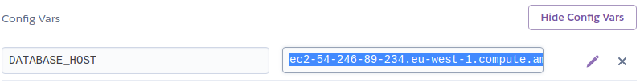
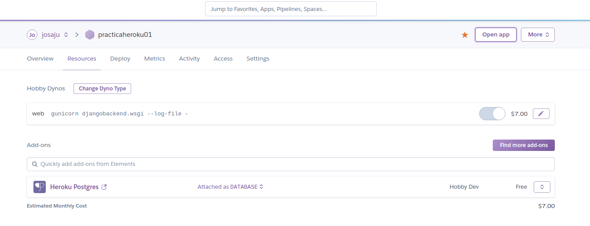
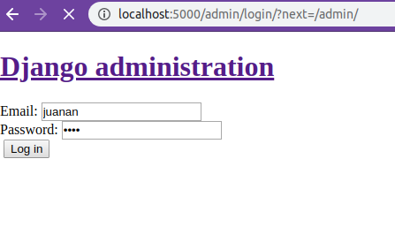

- Primer paso instalar heroku cli

Fichero Procfile
    web: gunicorn djangobackend.wsgi --log-file -


Fichero requirements.txt
    gunicorn

```
$ sudo snap install --classic heroku
```

despues 

```
$ heroku login
```


Creem el repositori 
añadim projecte 
add/commit/push a master

```
$ heroku create
```


```
$ heroku git:remote -a practicaheroku01
```


```
$ git push heroku master
```

Hemos tenido un error y tenemos que escribir el siguiente comando


```
$ heroku config:set DISABLE_COLLECTSTATIC=1D
$ git push heroku master
```


```
$ heroku ps:scale web=1
```


```
https://practicaheroku01.herokuapp.com/admin/login/?next=/admin/
```

Dins de practica resources/Heroku Postgres/Settings

Configuracion de varibles:

A continuación se muestra el proceso para configurar variables de entornos.

En primer lugar la añadiremos en la web de configuración de Heroku. En nuestro caso indicamos el host para acceder a la base de datos.



Para utilizarla en el servidor remoto deberemos indicarla en el código a traves de `os.environ['DATABASE_HOST']` En nuestro caso el código quedaría así...

```python
import os

DATABASES = {
    'default': {
        'ENGINE': 'django.db.backends.postgresql', 
        'NAME': 'ddkakh31l82q92',
        'USER': 'qvnpuwbhtdbfdx',
        'PASSWORD': '5ec51e7b97a504a46495f80794c8da1f64591cb2fcae422f8cba616b85960bcb',
        'HOST': os.environ['DATABASE_HOST'],
        'PORT': '5432',
    }
}
```

Para utilizarla en local bastará con crear un fichero .env con el siguiente contenido:
```
DATABASE_HOST=ec2-54-246-89-234.eu-west-1.compute.amazonaws.com
```


practicaheroku01/More/Run Console





- Instalación y configuración de Add-ons necesarios via Heroku CLI

Automaticamente al crear nuestra aplicación en Heroku nos ha instalado automaticamente el Add-on de "Heroku Postgres", ahora te esplicaremos el proceso de instalación.


Entraremos en nuesta aplicación y en la pestaña de "Resources" pulsaremos en el boton de "Find more add-ons"

Buscamos el Add-on que necessitemos y pulsamos sobre el boton "Install Heroku Postgres".


A continuación vamos a realizar una prueba de aplicación en entorno local.

Para ello ejecutamos el siguiente comando.
```
$ heroku local web
```
 

Pantalla de login.


Pantalla de administración (Después de iniciar sesión)