- Primer paso instalar heroku cli

Fichero Procfile
    web: gunicorn djangobackend.wsgi --log-file -


Fichero requirements.txt
    gunicorn

```
$ sudo snap install --classic heroku
```

despues 

```
$ heroku login
```
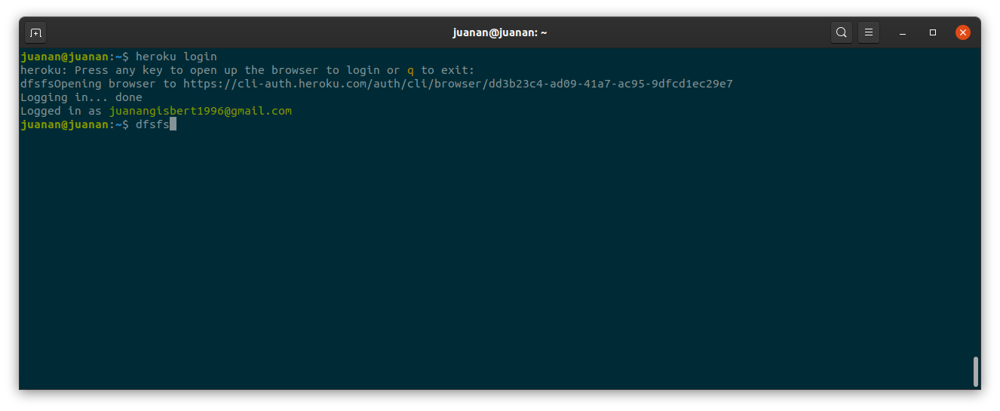


Creem el repositori 
añadim projecte 
add/commit/push a master

```
$ heroku create
```
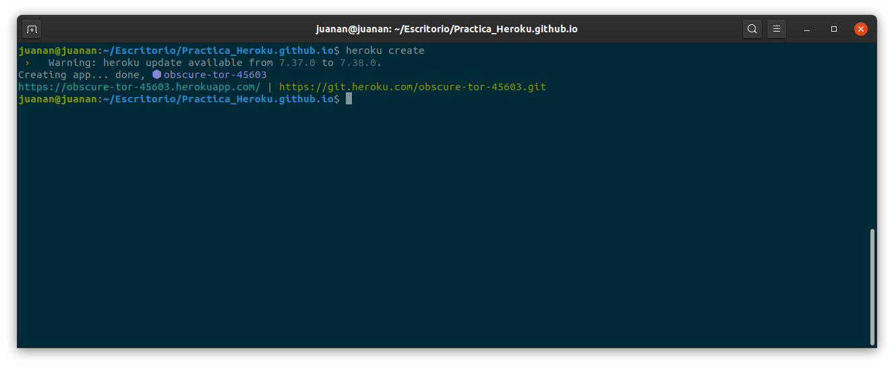


```
$ heroku git:remote -a practicaheroku01
```
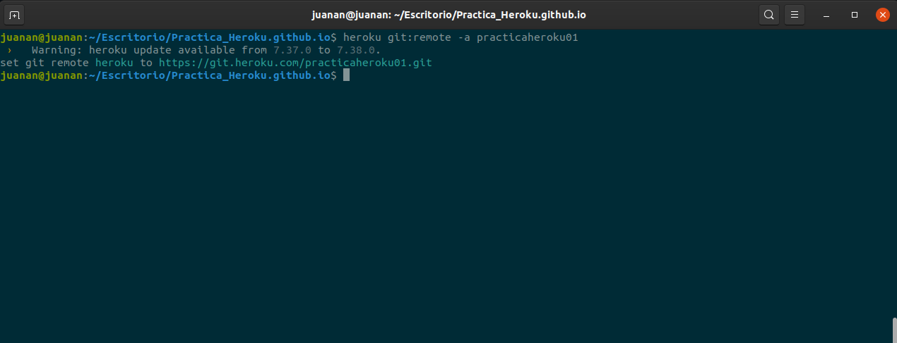


```
$ git push heroku master
```

Hemos tenido un error y tenemos que escribir el siguiente comando
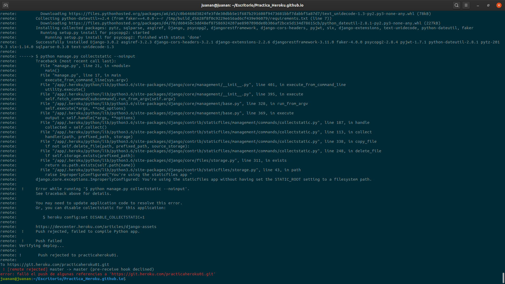

```
$ heroku config:set DISABLE_COLLECTSTATIC=1D
$ git push heroku master
```
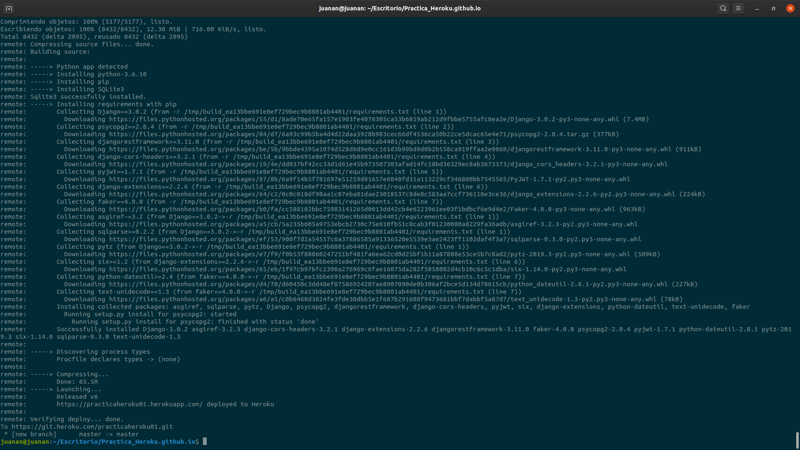

```
$ heroku ps:scale web=1
```
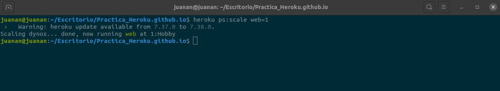


```
https://practicaheroku01.herokuapp.com/admin/login/?next=/admin/
```
cuant funcione
<!--  -->

Dins de practica resources/Heroku Postgres/Settings

Configuracion de settings

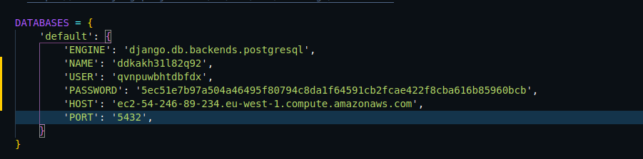

practicaheroku01/More/Run Console

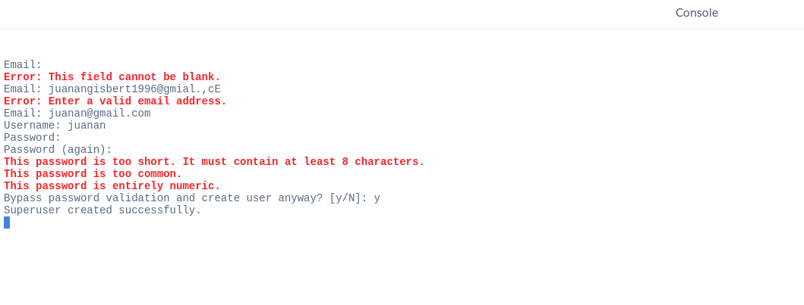


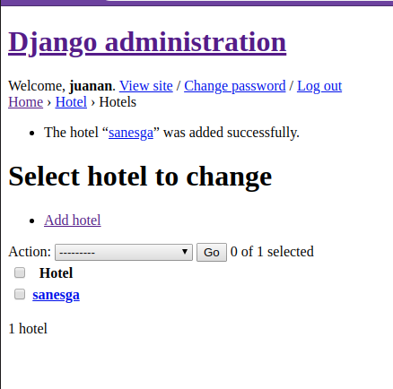

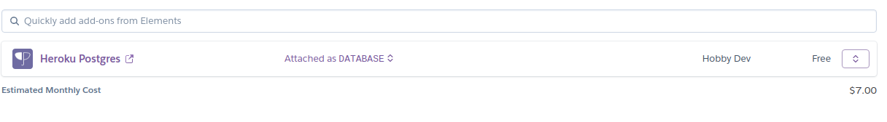


Start
```
$ heroku local web
```
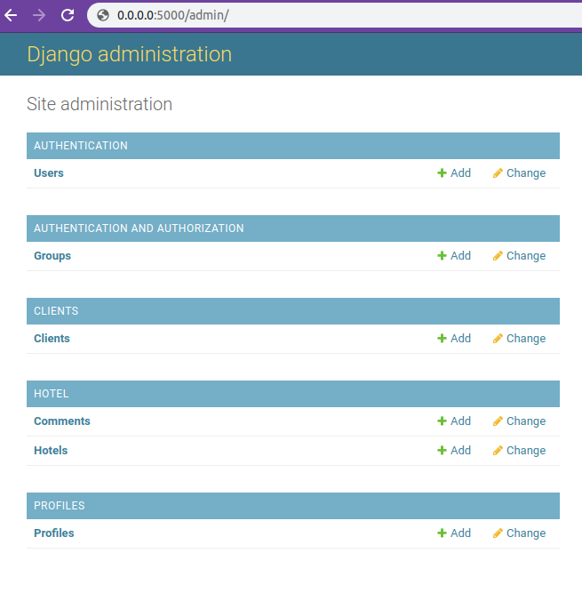