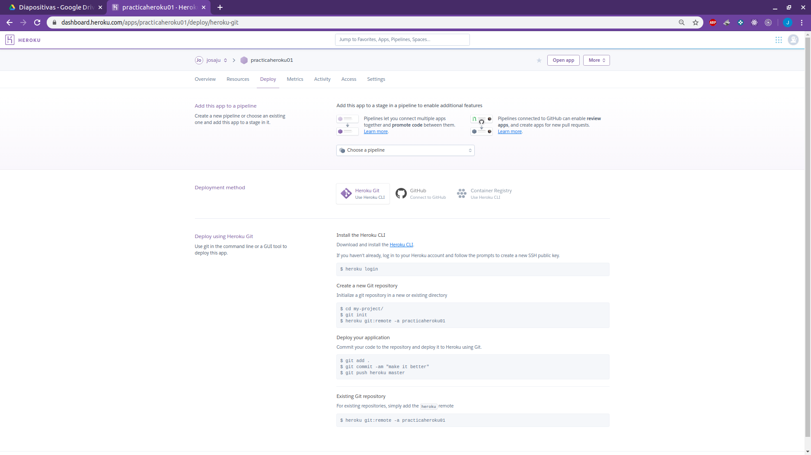
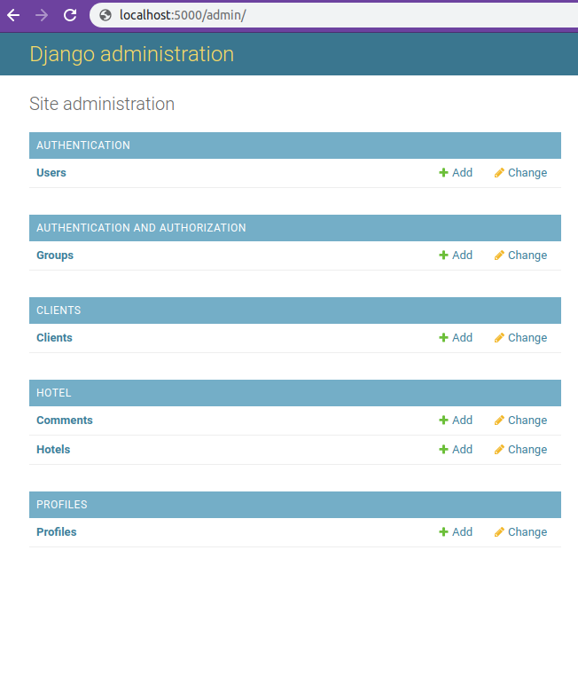

<h1 align="center" >PRÁCTICA HEROKU</h1>

<p align="center">
  
</p>

***

Enlace a GitHub Pages

https://juanantoniogisbert.github.io/Practica_Heroku.github.io/

***

## Enunciado

<p align="justify">
Documentar correctamente y de forma clara (crear app de Heroku, configuración de variables, Procfile, configuración de Add-ons necesarios, etc.) el proceso de despliegue en Heroku de alguna de las aplicaciones que hayáis (o estéis desarrollando en el módulo de Desarrollo Web en Entorno Servidor). Junto con la entrega debéis añadir la url de acceso a la aplicación desplegada en Heroku.</p>

<p align="justify">
Toda la configuración necesaria se realizará via Heroku CLI y será necesario configurar mínimo un add-on para la aplicación.
</p>

Se valorará lo siguiente:

1. Introducción sobre Heroku (1 punto).
2. Proceso de creación de la aplicación. Instalación de Heroku CLI, subir código a Github, crear Heroku app (2 puntos).
3. Configuración de variables (2 puntos).
4. Instalación y configuración de Add-ons necesarios via Heroku CLI (3 puntos).
5. Prueba de la aplicación en entorno local (1 punto).
6. Despliegue de la aplicación en entorno de Heroku (2 puntos).

***

## 1. Introducción sobre Heroku.

[Heroku] es un PaaS (Platform as a Service), es decir, una plataforma de desarrollo de aplicaciones Cloud. Un PaaS facilita las tareas de automatización del ciclo de vida, configuración, despliegue y escalado de software ofreciendo un conjunto de servicios que permiten desarrollar aplicaciones de forma rápida. Fue creado en 2007 y hoy en día es uno de los PaaS más utilizados.

Heroku utiliza contendores Linux llamados **dynos**, que son utilizados para alojar las aplicaciones web, webservices o aplicaciones que se ejecutan del lado del servidor. Asimismo, cuenta con la posibilidad de instalar [add-ons] para agregar funcionalidades a dichos contenedores, como por ejemplo, agregar servicios de administración de base de datos, almacenamiento en la nube o mensajería.

[heroku]: https://www.heroku.com/
[add-ons]: https://elements.heroku.com/addons 

**Ventajas:**

- Gratuito: Para aplicaciones de poco consumo.
- Seguro: Gracias a que los dynos se encuentran aislados entre sí, al firewall, a la administración y configuración de usuarios y privilegios, etc.
- Estable: Heroku utiliza la infraestructura AWS (Amazon Web Services) lo que garantiza un buen rendimiento, disponibilidad y estabilidad.
- Rápido: Gracias a que los dynos cuentan con buena capacidad de procesamiento.
- Escalable: Los dynos y add-ons se redimensionan fácilmente según necesidad.
- Multiplataforma: Si bien está basado en Linux, se puede utilizar en todos los demás sistemas operativos.
- Fácil de usar: Crear servicios y desplegar aplicaciones es fácil y rápido.
- Multilenguaje: Ofrece la posibilidad de trabajar con diferentes lenguajes de programación.


**Desventajas:**

- Poca personalización y mínima optimización cuando se requiere más infraestructura.
- Pocas opciones de add-ons y poco económicas.
- El control sobre el sistema operativo es prácticamente nulo.
- Límites en la utilización del servicio.
- No es posible almacenar archivos en el servidor dada la arquitectura y el ciclo de vida de los dynos.
- El guardado de logs es complicado.


**Comandos útiles**

- Subir cambios al repositorio Git y desplegarlos en Heroku

  ```
  git push heroku master
  ```

- Ejecutar en local:

  ```
  heroku local web
  ```

- Escalar aplicación (modificar el numero de dynos que se están ejecutando).

  - Detener:

    ```
    heroku ps:scale web=0
    ```

  - Arrancar:

    ```
    heroku ps:scale web=1
    ```

- Ver logs:

  ```
  heroku logs
  ```

- Ejecutar comandos en un dyno:

  ```
  heroku run bash
  ```

***

## 2. Proceso de creación de la aplicación. Instalación de Heroku CLI, subir código a Github, crear Heroku app (2 puntos).


- Primero, nos creamos una cuenta en la página de [Heroku].

  [heroku]: https://www.heroku.com/

  

- Existen dos formas de crear una aplicación Heroku, la primera es situarse en el directorio local de nuestro proyecto y ejecutar el comando:
 
  ```
  heroku create
  ```

  Este comando, nos crearía una rama remota llamada Heroku, que es la que nos permitiría interactuar con el sistema de despliegue de Heroku.

- Nosotros vamos a elegir la segunda opción, que es crear la aplicación desde la interfaz web de Heroku:

  

- Observamos que se ha creado la aplicación:

  

- Una vez hecho esto, creamos un repositorio en GitHub y subimos nuestro proyecto Django a la rama master como lo haríamos normalmente.

- Instalamos Heroku CLI, ejecutando este comando desde terminal:

   ```
   sudo snap install --classic heroku
   ```

- A continuación, hacemos login con el siguiente comando:

  ```
  heroku login
  ```

  Nos redirecciona a la página de Heroku para hacer login:

  
 
  

  


- Una vez hecho el login, vamos a nuestro proyecto de Django y en la raíz, creamos el fichero **Procfile**, que definirá según el tipo de proceso (web o worker principalmente), qué comando ejecutar para poder arrancar nuestra aplicación.

  Añadimos la siguiente línea al fichero:

  


  De esta manera especificamos que se trata de un proceso web y el nombre de nuestra aplicación.

- Para que el Procfile funcione, instalamos gunicorn para django con el siguiente comando desde terminal, situándonos en el directorio del proyecto:

   ```
   sudo pip install gunicorn
   ```

- Asimismo, añadimos gunicorn al fichero requirements.txt de nuestra aplicación Django:

  


- Como al principio, creamos nuestra aplicación Heroku desde la interfaz web de Heroku, solo nos queda asociar la aplicación con nuestro repositorio remoto:

  ```
  heroku git:remote -a practicaheroku01
  ```

  El nombre que especificamos en el comando, es el nombre que hemos asignado al proyecto en la interfaz web de Heroku.

  


- Subimos el proyecto a la rama master de Heroku:

  ```
  git add .
  ```

  ```
  git commit -m "add"
  ```
  
  ```
  git push heroku master
  ```

- Al realizar el push, nos devuelve el siguiente error:

  
  

- El error especifica que debemos deshabilitar la variable collectstatic, para ello ejecutamos el comando que nos ofrece:

  ```
  heroku config:set DISABLE_COLLECTSTATIC=1
  ```

- Volvemos a hacer el push y vemos que el error se ha resuelto.

  


- Observamos que la aplicación ya se encuentra desplegada en el entorno de heroku:

  https://practicaheroku01.herokuapp.com/admin/login/?next=/admin/


  


- Una vez creada la aplicación Heroku y asociado nuestro código a ella, el despliegue se producirá cada vez que hagamos un push a la rama remota Heroku.

***

## 3. Configuración de variables.


***

## 4. Instalación y configuración de Add-ons necesarios vía Heroku CLI.


***

## 5. Prueba de la aplicación en entorno local.


***

## 6. Despliegue de la aplicación en entorno de Heroku.


***


Dins de practica resources/Heroku Postgres/Settings

Configuracion de varibles:

A continuación se muestra el proceso para configurar variables de entornos.

En primer lugar la añadiremos en la web de configuración de Heroku. En nuestro caso indicamos el host para acceder a la base de datos.


Para utilizarla en el servidor remoto deberemos indicarla en el código a traves de `os.environ['DATABASE_HOST']` En nuestro caso el código quedaría así...

```python
import os

DATABASES = {
    'default': {
        'ENGINE': 'django.db.backends.postgresql', 
        'NAME': 'ddkakh31l82q92',
        'USER': 'qvnpuwbhtdbfdx',
        'PASSWORD': '5ec51e7b97a504a46495f80794c8da1f64591cb2fcae422f8cba616b85960bcb',
        'HOST': os.environ['DATABASE_HOST'],
        'PORT': '5432',
    }
}
```

Para utilizarla en local bastará con crear un fichero .env con el siguiente contenido:
```
DATABASE_HOST=ec2-54-246-89-234.eu-west-1.compute.amazonaws.com
```


practicaheroku01/More/Run Console


- Instalación y configuración de Add-ons necesarios via Heroku CLI

Automaticamente al crear nuestra aplicación en Heroku nos ha instalado automaticamente el Add-on de "Heroku Postgres", ahora te esplicaremos el proceso de instalación.


Entraremos en nuesta aplicación y en la pestaña de "Resources" pulsaremos en el boton de "Find more add-ons"

Buscamos el Add-on que necessitemos y pulsamos sobre el boton "Install Heroku Postgres".


A continuación vamos a realizar una prueba de aplicación en entorno local.

Para ello ejecutamos el siguiente comando.
```
$ heroku local web
```
 

Pantalla de login.



Pantalla de administración (Después de iniciar sesión)